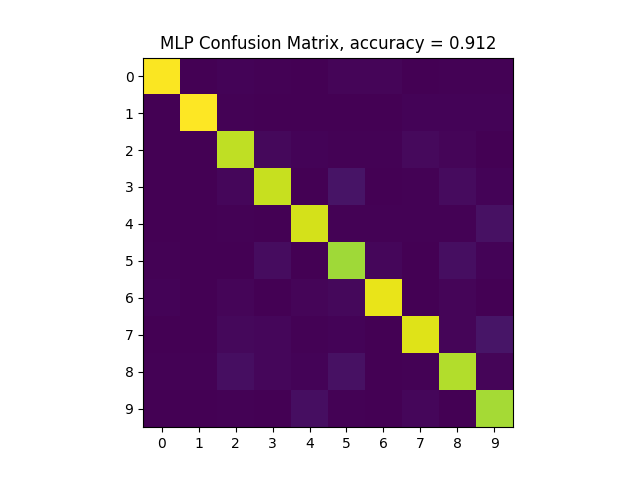

## MNIST
This repository contains an MNIST image/label parser and
multi-layer perceptron (MLP) classifier written from scratch in C++. 

OpenCV is used to view and normalize images; the googletest framework is used
for unit testing; OpenMP is used to parallelize MLP training; CBLAS is used for
matrix multiplications; and CMake is used as the build system.

MNIST data files can be found at
[http://yann.lecun.com/exdb/mnist/](http://yann.lecun.com/exdb/mnist/)

A model with 300 hidden units was trained for 100 epochs on the training data
using an 80/20 training-validation split. The classification performance of that
model on the 10,000 image test set is shown below. The model is provided in the
[results](/results/models/model_10-26-1733)
directory for reference. A pytorch implementation of the same model is also included
for comparison (see [mnist_models.py](/src/mnist_mlp.py) + [model](/results/models/model_10-31-1339/)),
and achieves an accuracy of 97.88% on the test set.



## Build

```
cd scripts
./build.sh
```
## Run

To train a model from scratch...
```
cd scripts
./run.sh
```

To train a model from a checkpoint...
```
cd scripts
./run.sh load-mlp <path-to-checkpoint>
```

Or to load an existing model and evaluate on test images...
```
cd scripts
./run.sh test-mlp <path-to-checkpoint>
```

## Run Google Tests
```
cd scripts
./run.sh test
```
