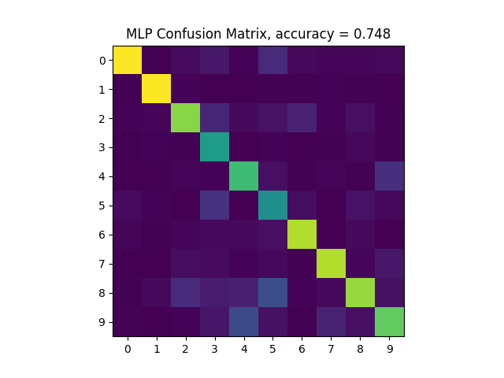

This repository contains an MNIST image/label parser and
multi-layer perceptron (MLP) classifier written from scratch in C++. 

OpenCV is used to view and normalize images; the googletest framework is used
for unit testing; OpenMP is used to parallelize MLP training; CBLAS is used for
matrix multiplications; and CMake is used as the build system.

MNIST data files can be found at
[http://yann.lecun.com/exdb/mnist/](http://yann.lecun.com/exdb/mnist/)



# Usage instructions
## Build
```
cd scripts
./build.sh
```
## Run
```
cd scripts
./run.sh
```
Or to load weights from file and evaluate on test images...
```
cd scripts
./run.sh load <path-to-weights>
```

## Run Tests
```
cd scripts
./run.sh test
```

